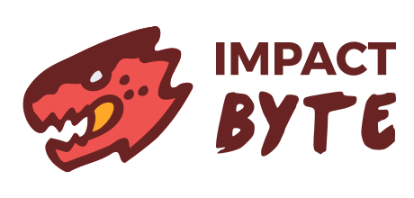

#Impact Byte Learn - Course: Beginner Web Programming

Hello Students! Welcome to the  beginner web programming course from Impact Byte.

---

## Learning Chapters

* [Chapter 1](chapter-1/README.md): Introduction, Git, Github, Editor, HTML, npm, http-server, CSS, Javascript
* [Chapter 2](chapter-2/README.md): Javascript, npm, React, Reactstrap, React Router
* [Chapter 3](chapter-3/README.md): Javascript, React Lifecyle, React Transition, json-server, Axios
* [Chapter 4](chapter-4/README.md): REST API, Redux, Facebook Login, React Atomic Design, Story books
* [Chapter 5](chapter-5/README.md): Redux, Web Performance, publish, Case Study Shoppee
* [Chapter 6](chapter-6/README.md): Case Study Shoppee
* [Chapter 7](chapter-7/README.md): Final Project
* [Chapter 8](chapter-8/README.md): Final Project, Presentation

---

## References

### Guide

* [Roadmap to becoming a front end web developer in 2018](https://github.com/kamranahmedse/developer-roadmap#frontend-roadmap)
* [Front-End Developer Handbook 2018](https://frontendmasters.com/books/front-end-handbook/2018)

### Directory

* [Product Hunt](http://producthunt.com)
* [Siftery - Share products you use at work, explore what others are using](https://siftery.com)
* [LibHunt - Find The Software You Need](https://www.libhunt.com)