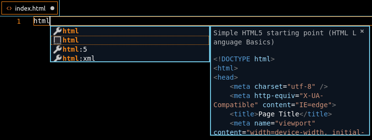

# Practice 1

work on our current project folder (`learn-reactjs`). Create folder `practice-1` and we do our practice in that folder.
we will create simple web app like this [link](https://www.figma.com/file/ST25iCuxqnKUAa1mzU628u59/part-time-beginner-web-practice-1?node-id=0%3A1)

---

## 1.   create index.html

* Create file named `index.html` use snipped suggestion & use it
  
* Update it like [html-1](./../../../modules/html-1/README.md) lesson

### 1. header tag

code inside `body` tag at top. with this code
```html
<nav>
    <a href="/jual.html">Jual</a> | 
    <a href="/download.html">Download</a> |
    <!-- pls add more with notifikasi, bantuan, daftar & login -->
</nav>
```

To show on our web browser. use `http-server` like [npm-1](./../../../modules/npm-1/README.md) lesson

### 2.   input tag

```html
<!-- add below nav tag -->
<div>
    <span>Logo</span>
    <input placeholder="cari produk, merek & toko">
    <button>Cari</button>
    <button>Keranjang Belanja</button>
</div>
```

try open our browser where http-server is running and see what the result is.

### 3.   Table

```html
<!-- add below input tag -->
<table border="1">
    <caption>Top title</caption>
    <thead>
        <tr>
            <th rowspan="2">No</th>
            <th colspan="3">This is table</th>
        </tr>
        <tr>
            <th>Name</th>
            <th>Class</th>
            <th>Score</th>
        </tr>
    </thead>
    <tbody>
        <tr>
            <td>1</td>
            <td>Budi</td>
            <td>Programmer Enginner</td>
            <td>2.9</td>
        </tr>
    </tbody>
    <tfooter>
        <tr>
            <td colspan="3">Total</td>
            <td>300</td>
        </tr>
    <tfooter>
</table>
```

### 4.   Images

```html
    
    
    
    <div style="width:40%; display:inline-block">
        
    </div>
```
### 5.   Buttons

```html
<button onclick="alert('im clicked)">click me</button>
```

### 6.   Form

```html
<form>
    <input type="search" name="search"/>
    <button type="submit">Submit</button>
    <button type="reset">Reset</button>
    <button type="button">Do nothing</button>
</form>
```

### 7.  Horizontal Rule

```html
<hr/>
i'm in the middle horizonal ruler
<hr/>
```

### 8.  Break

```html
<br>
this below use 1 break
<br>
this text has 2 breaks below
<br>
<br>
it's vertical space
```

## 3. Push to gitub

this is how to push our code to github. In [here](./../../../modules/vscode-push-1/README.md)