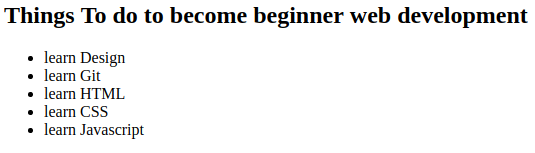

# Git, HTML homework

---

####1. create School time table

* create my school time table from monday to friday/saturday
* create github repo named `school-time-table`, put my code in this repo.

####2. create list to become beginner web developer 

* create list like below picture

* use `h2`, `ul`, `li` tag
* create github repo named `list-to-become-beginner-web-developer`, put my code in this repo.
* after finished, try to change `ul` tag to `ol` tag and see what happen