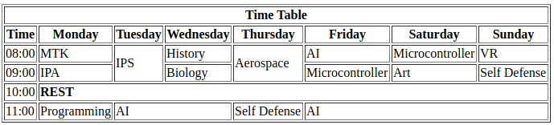

# Practice 2

---

Create folder named `practice-2` on previous repository inside folder `public`. in side `practice-2` folder we create file named `index.html`

## 1. Create table

## 2. Create list

