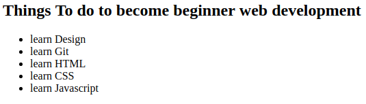

# Practice 2

---

## 1. HTML
Create folder named `practice-2` on previous repository inside folder `public`. in side `practice-2` folder we create file named `index.html`

### 1. Create table


### 2. Create list



---

## 2. CSS
create a file named `learn-css.css` & added into `index.html`

### 1. Buttons

on `index.html` add this

```html

<button class="btn btn-primary">Success</button>
<button class="btn btn-info">Info</button>
<button class="btn btn-warning">Warning</button>
<button class="btn btn-danger">Danger</button>

```

on `learn-css.css` add this

```css
.btn {
    display: inline-block;
    text-align: center;
    vertical-align: middle;
    border: 1px solid transparent;
    padding: .3em 7em;
    border-radius: .2em;
}

.btn-primary {
    color: #fff;
    background-color:red;
    border-color:#b90404;
}
```

see how it work.

add css for class `btn-info` `warning` and `danger`. add with your color

---

## 3. JS

create file `learn-js.js` add to `index.html`

### 1. [Numeraljs](http://numeraljs.com/)


