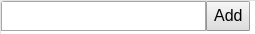
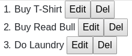

# Practice 5 (todo list app)

we want to build simple todo list app

as user
1. i can add todo so it can saved to database
2. i can see what todo that i've got
3. i can edit each todo list
4. i can delete each todo list

---

## Design

---

## Preparation

* Create repository on github named `practice-5-todo-list-app`
* Clone this repo to our laptop
* Do `create-react-app` inside `practice-5-todo-list-app`
* Install `storybook`, `json-server`

---

## Version 1 (Simple view)

we create web app view without any function / interaction with user

--- 

## Todo

* Create `AddList` folder in `organisms` folder. Create `index.js` & `stories.js`. It consist of `input` & `button` HTML tag
  
  

  and `ShowList` folder in `organisms` folder. Create `index.js` & `stories.js`. It consist of list (using HTML tag `l0`, `li`, `button`)
  
  
  
* Combine them in `templates` folder and create folder named `TodoList` and put in here. try test using storybook
* Create `TodoList` folder on `pages`. inside `TodoList` folder has file where add component of `templates/TodoList`
* Change App.js to load `pages/TodoList`
* try run using `npm run start` & try open on your browser

results

---
## [Version 2](./README2.md)