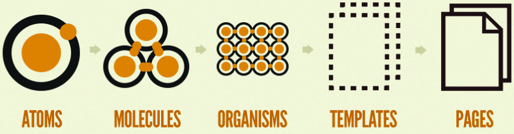
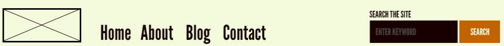
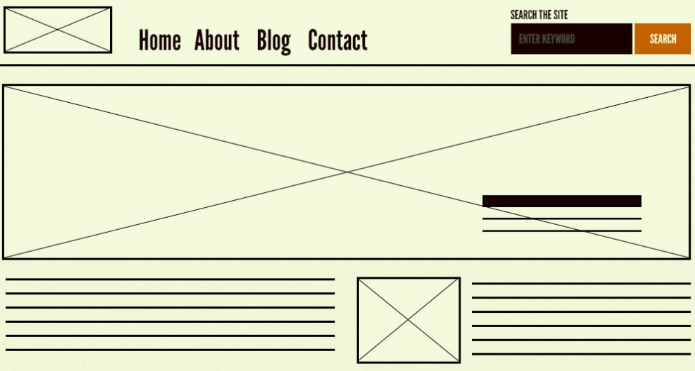

# Atomic Design 1

---

## Introduction

Organize code by design system by hierarchy, in this case by folder structure & importance
<!-- because frontend development is getting more complicated by the our code -->

---

## What it is?



### Atoms

Is a native html tag, a React Component that renders and html tag or any third party component.
to begin create folder named `components` inside `src` folder. in `components` folder, create 5 folder named `atoms`, `molecules`, `organisms`, `templates`, `pages`

```js
// atoms/Input.js
const Input = props => <input placeholder="ENTER KEYWORD" />
```


```js
// atoms/Label.js
const Label = props => <label>SEARCH THE SITE</label>
```


### Molecules

Is a group of atoms

```js
// molecules/Field.js
import Label from './../atoms/Label';
import Input from './../atoms/Input';

const Field = () => {
    <div>
        <Label/>
        <Input/>
    </div>
}
```


### Organisms

Is a group of atoms, molecules and/or other organisms

```js
// organisms/Header.js
import Field from './../molecules/Field';
import Nav from './../molecules/Nav';
import Logo from './../atom/Logo';

const Header = (props) => (
    <div>
        <Logo/>
        <Nav/>
        <Field/>
    </div>
)
```


### Templates

Is a layout to be used on pages

```js
// templates/PageTemplate.js
const PageTemplate = ({header, children }) => (
    <main>
        {header && <div>{header}</div>}
        {children}
    </main>
)
```



### Pages

Is where you will put mostly (but not exclusively) organisms:

```js
// pages/HomePage.js
    const HomePage = () => {
        <PageTemplate header={<Header />}>
            <Form/>
        </PageTemplate>
    }
```

