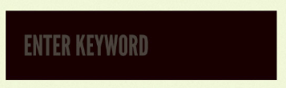

# Atomic Design 1

---

## Introduction

Organize code by design system by hierarchy, in this case by folder structure & importance
<!-- because frontend development is getting more complicated by the our code -->

---

## What it is?


### Atoms

Is a native html tag, a React Component that renders and html tag or any third party component

```js
// atoms/Input.js
const input = props => <input {...props} />
```

```js
// atoms/Label.js
const Label = props => <label {...props} />
```

### Molecules

Is a group of atoms

```js
// molecules/Field.js
const Field = ({ label, ...inputProps }) => {
    <Label>
        {label}
        <Input {...inputProps} />
    </Label>
}
```

### Organisms

Is a group of atoms, molecules and/or other organisms

```js
// organisms/Form.js
const Form = (props) => (
    <Form {...props}>
        <Field label="Name" type="text"/>
        <Field label="Email" type="email" />
    </form>
)
```

### Templates

Is a layout to be used on pages

```js
// templates/PageTemplate.js
const PageTemplate = ({header, children }) => (
    <main>
        {header && <div>{header}</div>}
        {children}
    </main>
)
```

### Pages

Is where you will put mostly (but not exclusively) organisms:

```js
// pages/HomePage.js
    const HomePage = () => {
        <PageTemplate header={<Header />}>
            <Form/>
        </PageTemplate>
    }
```

---

## Picture illustration

### Atoms





### Molecule


### Organism


### Template


### Page


