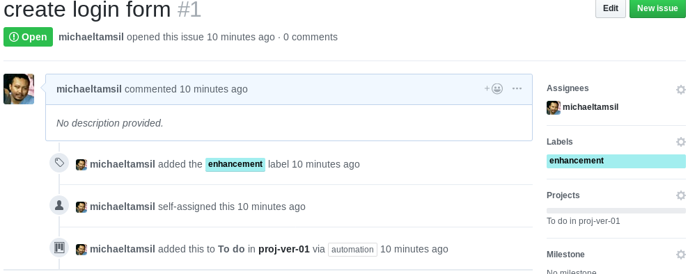
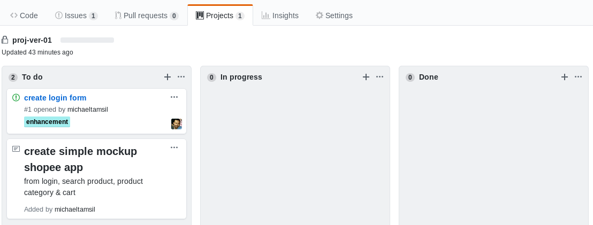

# Create Issue 1

---

## Things to do

Create issue based on `project-ver-01` description. for now we will create 5 issues there are

    1. create simple mockup app
    2. create login form
    3. create search product
    4. create product categry
    5. create cart

where 6 items has label with named `enhancement`. project named `project-ver-01`
    

with this it will automaticly added on our project list todo.

