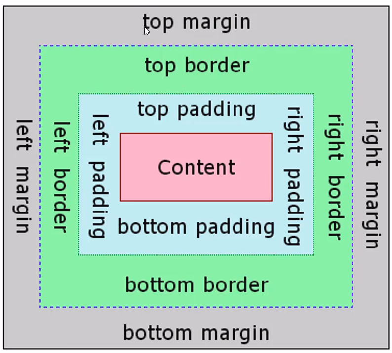

# CSS 1

---

## CSS (Cascading Style Sheet)

CSS is a way to style HTML page to beautiful. File name with `.css` as suffix or extension name.

---

## CSS Syntax

```css
/* A CSS syntax */
selector {
  property: value;
}
```

- selector: defines targeted html element/elements
- property: defines property to alter
- value: defines value of css property

Example :
in HTML file
```html
<h1>To Do list</h1>
```

in CSS file
```css
h1 {
  color: red;
}
```

---

## HTML + CSS

This is good way to use CSS into HTML.

### `link` HTML tag

on HTML:

```html
<link rel="stylesheet" href="./index.css">
```

on CSS:

```css
/* CSS code here */
selector {
  property: value;
}
```

---

## CSS Selectors

CSS selectors define which HTML elements we want our styling to be applied to.


**1. Class Selector**

```html
<p class="date">
  Saturday Feb 21
</p>
```

```css
.date {
  font-weight: bold;
  font-size: 2em;
}
```

**2. Tag HTML Selector**

```css
a {
  text-decoration: none;
}
```


**3. ID Selector**

```html
<h1 id="tagline">This heading will be orange.</h1>
```

```css
#tagline {
  color: orange;
}
```

**4. Multiple elements**

```css
p,
a,
.date {
  margin: .5em auto;
}
```

**5. Child Element**

```html
<p>
  <a>link</a>
</p>
```

```css
p a {
  font-size: 1.5em;
}
```

---

## CSS Color Units

Color in CSS has some formats like name & hex code.

```css
.class {
  color: white; /* name */
  color: #ffffff; /* hex */
  color: #fff; /* hex */
}
```

---

## CSS Size Units

We can specify the `width` and `height` of the element using various format like pixel, percetage, or em.

```css
.class {
  width: 200px;
  height: 20%;
  margin: 2em;
}
```

`em` means `emphemeral unit` so size is relative to parent size. if parent have size 12px so child have 12px font size. if child have `font-size: 2em`, means the child size is 24px;

---

## CSS Box Model

All HTML elements can be considered as boxes. In CSS, the term "box model" is used when talking about design and layout.



- Content - The content of the box, where text, images, or **another element**
- Padding - Clears an area around the content. The padding is transparent
- Border - A border that goes around the padding and content
- Margin - Clears an area outside the border. The margin is transparent

### CSS Background

The background of an HTML element is what appears behind the text. We can set an image or a color to be a background of the HTML element.

```css
#example {
  background-color: blue;
  background-image: url(./images/impactbyte.png);
  background-repeat: no-repeat;
}
```

### CSS Display

CSS display properties can change display type of the HTML element. For example `<p>` element display default type is block and `<span>` display default type is inline. With display properties we can change `<span>` default type to be block.

Each display options have specific rendering behaviors:

- **block** : Will take up the whole width available.
- **inline** : Will take up the width just as text width (will ignore `width`, top/bottom `margin`,and top/bottom `padding`).
- **inline-block** : Simmilar to inline but we can set `width` , top/bottom `margin`,and top/bottom `padding`.

```css
#example1 {
  display: block;
}

#example2 {
  display: inline;
}

#example3 {
  display: inline-block;
}
```

### CSS Height and Width

With height and width properties we can set the height and width of an element.

```css
#example {
  width: 50%;
  height: 200px;
}
```

### CSS Border

HTML element rendered as rectangle. So it has 4 possible sides:

- `border-top`
- `border-bottom`
- `border-left`
- `border-right`

and has many properties :

- `border-color` : defined by using a color unit
- `border-style` : can be solid, dashed, dotted…
- `border-width` : defined by using a size unit

```css
#example1 {
  border-color: blue; /* Color Units */
  border-style: solid; /* none | dotted | dashed | groove | etc ... */
  border-width: 3px; /* Size Units */
  border-radius 50%; /* rounded element */
}

/* Custom specific side of border*/
#example2 {
  border-bottom-color: blue; /* Color Units */
  border-bottom-style: solid; /* none | dotted | dashed | groove | etc ... */
  border-bottom-width: 3px; /* Size Units */
}
```

---

## CSS Margin & Padding

Padding is space between content and border and Margin is space between border and another element. And because all html elements redered as rectagle, both Padding and Margin has 4 possible sides (top,bottom,left,right).

```css
/* set all sides of margin and padding */
#example1 {
  padding: 20px;
  margin: 20px;
}

/* set specific side */
#example2 {
  margin-top: 20px;
  margin-left: 20px;
  padding-top: 100px;
}
```

---

## CSS Size Shorthand Wheel

There is another way to specify Padding and Margin.

```css
#example1 {
  padding: 20px 0 10px 5px; /* the order is top,right,bottom, and left*/
}

#example {
  padding: 20px 0; /* Padding top and bottom 20px, Padding left and right 0 */
}
```

---

## References

- [https://w3schools.com/css/default.asp](https://w3schools.com/css/default.asp)