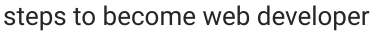
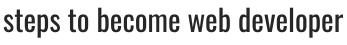
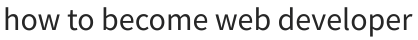
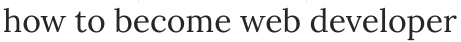

# CSS 2

---

## CSS Position

With CSS `position` we can alter an element position. It has 4 possible value:

- Static : Default value of position properties, They aren’t affected by any left, right, top or bottom value.
- Relative : Move element according to current position, without affecting another element.
- Absolute : When the position is set to absolute, an element can move according to the first positioned ancestor.
- Fixed : Move element according to browser window.

With 4 coordinates properties:

- Left
- Right
- Top
- Bottom

```css
/* Position relative example */
#relative-example {
  position: relative;
  border-color: red;
  left: 20px;
  top: 10px;
}

/* Position absolute example */
#relative-div {
  background: gold;
  height: 200px;
  padding: 10px;
  position: relative; /* This turns the #relative-div into a point of reference for the #absolute-div */
}

#absolute-div {
  background: limegreen;
  color: white;
  padding: 10px;
  position: absolute; /* This makes the #absolute-div freely movable */
  bottom: 10px; /* 10px from the bottom */
  left: 20px; /* 20px from the left */
}

/* Position fixed example*/
#fixed-example {
  position: fixed;
  left: 100px;
  top: 150px;
}
```

---

## CSS Web Fonts

We can add good fonts to our website. we can try [google fonts](https://fonts.google.com/).
famous google fonts are:

|font-family | Example |
|---|---|
| [Roboto](https://fonts.google.com/?query=roboto&category=Sans+Serif) |  |
| [Oswald](https://fonts.google.com/?query=oswald&category=Sans+Serif) |  |
| [Source Sans Pro](https://fonts.google.com/?query=sans+pro&category=Sans+Serif) |  |
| [Lora](https://fonts.google.com/?query=lora&category=Serif) |  |
| [Concert One](https://fonts.google.com/?query=concert&category=Display) |  |

### how to use

```CSS
p  {
  font-family: "Lucida Console", monaco, monospace;
}
```

### Safe fonts

  * font-family: Arial, Helvetica, sans-serif
  * font-family: "Bookman Old Style", serif
  * font-family: "Comic Sans MS", cursive, sans-serif
  * font-family: Impact, sans-serif
  * font-family: "Lucida Console", monaco, monospace
  * font-family: "Palatino Linotype", "Book Antiqua", serif
  * font-family: "Times New Roman", serif
  * font-family: Verdana, Geneva, sans-serif
  
---