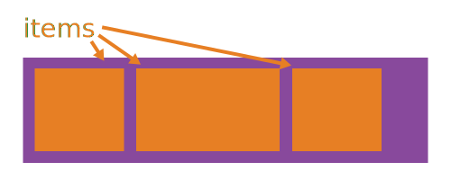
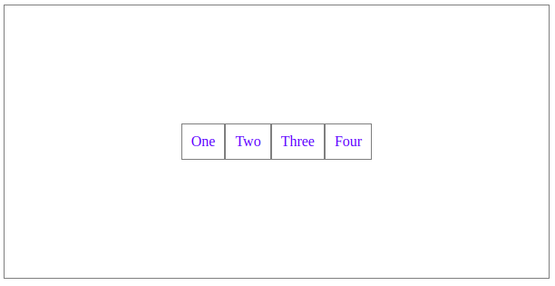

# CSS 2

---

## CSS Position

With CSS `position` we can alter an element position. It has 4 possible value:

- Static : Default value of position properties, They aren’t affected by any left, right, top or bottom value.
- Relative : Move element according to current position, without affecting another element.
- Absolute : When the position is set to absolute, an element can move according to the first positioned ancestor.
- Fixed : Move element according to browser window.

With 4 coordinates properties:

- Left
- Right
- Top
- Bottom

```css
/* Position relative example */
#relative-example {
  position: relative;
  border-color: red;
  left: 20px;
  top: 10px;
}

/* Position absolute example */
#relative-div {
  background: gold;
  height: 200px;
  padding: 10px;
  position: relative; /* This turns the #relative-div into a point of reference for the #absolute-div */
}

#absolute-div {
  background: limegreen;
  color: white;
  padding: 10px;
  position: absolute; /* This makes the #absolute-div freely movable */
  bottom: 10px; /* 10px from the bottom */
  left: 20px; /* 20px from the left */
}

/* Position fixed example*/
#fixed-example {
  position: fixed;
  left: 100px;
  top: 150px;
}
```

---

## CSS Web Safe Fonts

The font-family property should hold several font names as a "fallback" system, to ensure maximum compatibility between browsers/ OS. **If the browser does not support the first font, it tries the next font**.

Start with the font you want, and end with a generic family, to let the **browser pick a similar font in the generic family**, **if no other fonts are available**

```CSS
p  {
  font-family: "Lucida Console", monaco, monospace;
}
```

Example:


#### references
* [common fonts used](https://websitesetup.org/web-safe-fonts-html-css)
* [google fonts](https://fonts.google.com/)

---

## CSS Flexbox

In flexbox (`display: flex;`) layout system, there is a way to control other element positions. It's a more efficient way to lay out, align, and distribute space among items in a container. Even when their size is unknown and/or dynamic (thus the word "flex").

* `container`: parent element which can control their children/items positions
* `items`: children element/s which being controlled by their parent/container




CSS:

```css
.container {
  display: flex;
  justify-content: center;
  align-items: center;
}

.item {
  color: blue;
}
```

HTML:

```html
<section class="container">
  <div class="item">One</div>
  <div class="item">Two</div>
  <div class="item">Three</div>
  <div class="item">Four</div>
</section>
```

Result:



### `justify-content`

* `flex-start`: Items align to the left side of the container
* `flex-end`: Items align to the right side of the container
* `center`: Items align at the center of the container
* `space-between`: Items display with equal spacing between them
* `space-around`: Items display with equal spacing around them

### `align-items`

* `flex-start`: Items align to the top of the container
* `flex-end`: Items align to the bottom of the container
* `center`: Items align at the vertical center of the container
* `baseline`: Items display at the baseline of the container
* `stretch`: Items are stretched to fit the container

### `flex-direction`

* `row`: Items are placed the same as the text direction.
* `row-reverse`: Items are placed opposite to the text direction.
* `column`: Items are placed top to bottom.
* `column-reverse`: Items are placed bottom to top.

---

## References

* <https://css-tricks.com/snippets/css/a-guide-to-flexbox>
* <http://flexboxfroggy.com>