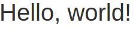
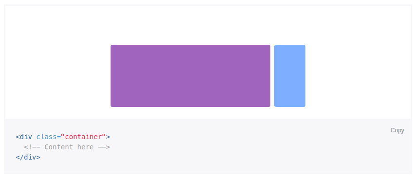
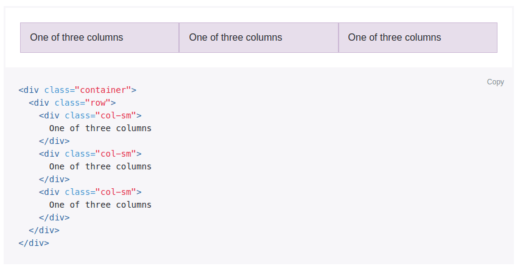
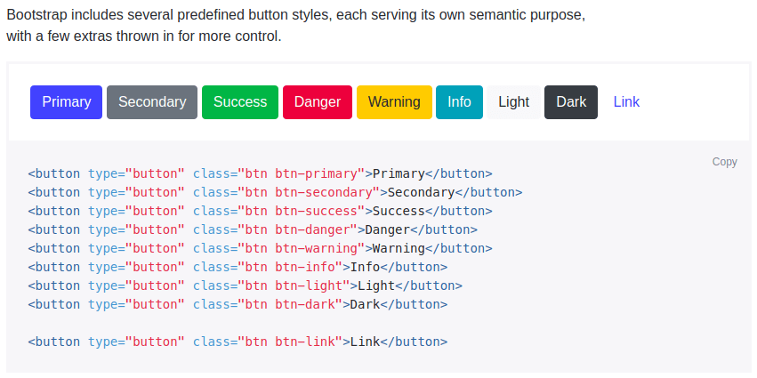
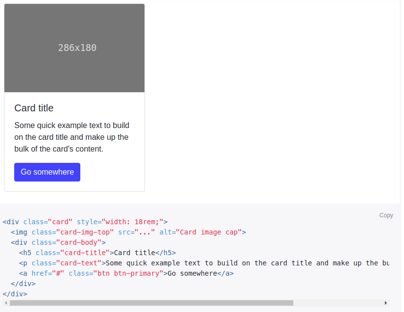
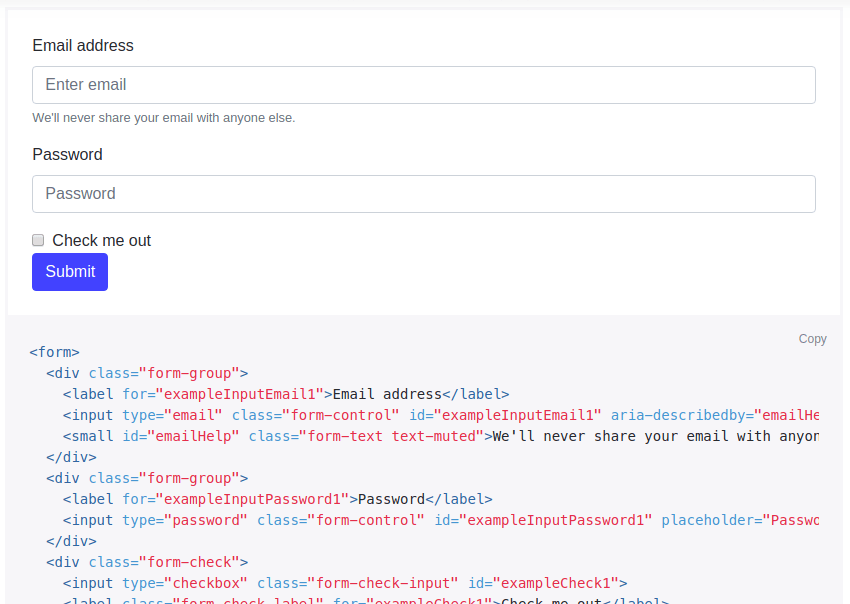
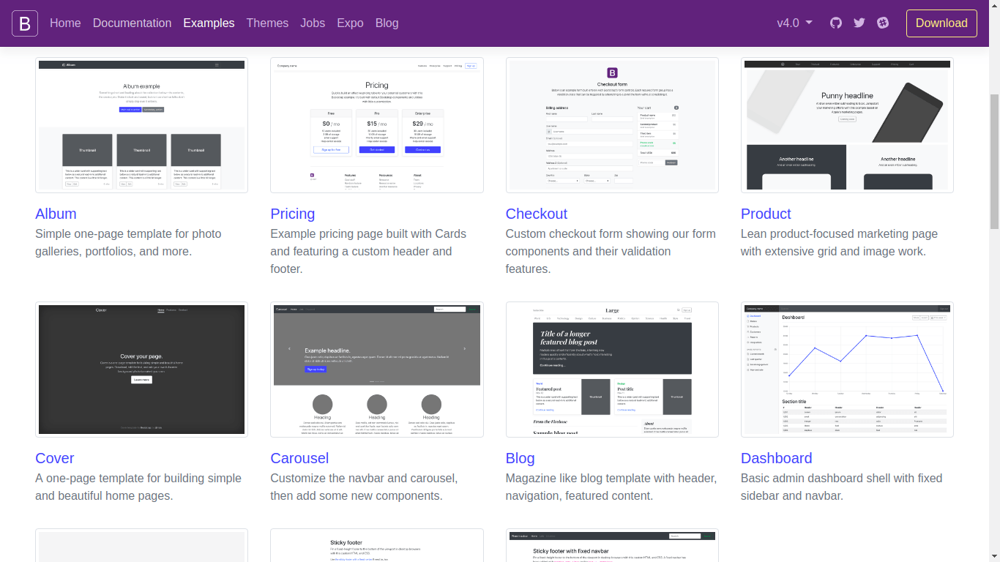

# CSS Framework 1

## Twitter Bootstrap
[Bootstrap](https://getbootstrap.com), originally created by Twitter, is the most popular UI design framework that consists of best practices and predefined CSS classes.

It also includes a responsive grid system and various plugins.

To get started officially, visit their [Introduction page](https://getbootstrap.com/docs/4.0/getting-started/introduction).

Basically we can either use its CSS directly into our HTML, or download the library/framework first.

```html
<link rel="stylesheet" href="https://maxcdn.bootstrapcdn.com/bootstrap/4.0.0/css/bootstrap.min.css">
```

For now you don't need to include the JavaScript files.

Here's a starter template to start with.

```html
<!DOCTYPE html>
<html lang="en">

<head>
  <!-- Required meta tags -->
  <meta charset="UTF-8">
  <meta name="viewport" content="width=device-width, initial-scale=1, shrink-to-fit=no">

  <!-- Bootstrap CSS -->

  <link rel="stylesheet" href="https://maxcdn.bootstrapcdn.com/bootstrap/4.0.0/css/bootstrap.min.css">

  <title>Hello, world!</title>
</head>

<body>
  <div>
    <h1>Hello, world!</h1>
  </div>
</body>

</html>
```

Result:



With Bootstrap, there are several premade design ready for us to use.

### [Layout](https://getbootstrap.com/docs/4.0/layout/overview)

The grid layout system in Bootstrap is using `container`, `row`, and `col` classes to layout and align content.

How it actually works is by using a combination of flexbox and CSS [`@media` query](https://www.w3schools.com/css/css_rwd_mediaqueries.asp), also fully responsive.





### [Content](https://getbootstrap.com/docs/4.0/components)

[Buttons](https://getbootstrap.com/docs/4.0/components/buttons):



[Card](https://getbootstrap.com/docs/4.0/components/card):



[Forms](https://getbootstrap.com/docs/4.0/components/forms):



### [Examples](https://getbootstrap.com/docs/4.0/examples)

There are even various examples we can use.



---

## CSS Animation

There's a simple animation library with just only CSS called [Animate.css](https://daneden.github.io/animate.css).


---

## References

* <https://getbootstrap.com>
* [snippet](https://bootsnipp.com/)
* [themes](https://bootswatch.com/)
