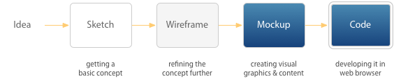
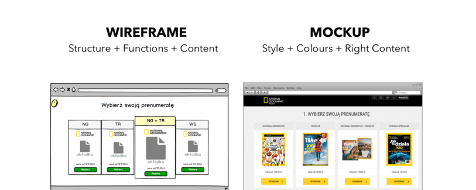
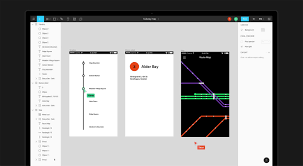
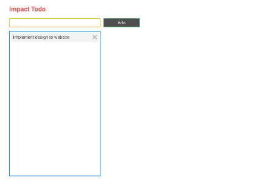

# Design 1

---

## Introduction

before we do design, start with Idea / problem


## Idea

is solution from problem.
is things to do, something we will make it happen, for developer usually is list of functions that will happen. Storyframe need to be type on docs / google docs 

### idea example

```
build my personal website
```

### storyframe example

```
Hi, my name is Michael Tamsil 

you can see my experience / about what i did / achieve in my work

you can see my study what university i got in and graduation 

you can see my interest / hobby and probably have common interest with you

you can see my photos & videos (i can be your hobbies)

you can see me on my social media so you can know me more or contact me
```

each paragraph / sentences can be made as module / function that we will work on

## Sketch


## UI (User Interface) Design



---

## Wireframe vs Mockup vs Prototype

Commonly when designing a website or application, we are recommended to visualize it first.

Wireframing is the easiest design method to create just the essentials. Plan out the content, positioning, and more.

Mockup is the bare minimum of the design. We can see better layout, colors, typography, images, and more.

Prototype is often the advanced one where we can make the mockup interactively used. Without having to code it.



Now [here's an example](https://www.figma.com/proto/ID5EGTB6c4ARMn2CwfRe3AL1/Mockup-v1) of an interactive prototype of the app we're building. You can play around by clicking the highlighted areas: input box, add button, and delete button.

[](https://www.figma.com/proto/ID5EGTB6c4ARMn2CwfRe3AL1/Mockup-v1)

---

## Design Tool

Nowadays, we can just use online design tool to create a mockup or graphic design. Let's use [Figma](https://figma.com) for a start, and follow along with the predefined design wireframe/mockup for our app.
