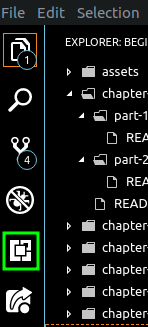
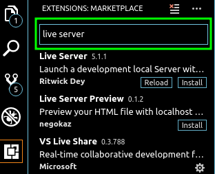

# Editor 1

---
## Editor
Editor is place / application to edit file for developer

## Visual Studio Code (VS Code)

VS Code is code editor to fast to open, small, can install on any OS and many useful plugins to help us. because of that, it become most developers editor used today.

[install](https://code.visualstudio.com/download) it on your OS.

--- 

## Plugins

plugin is additional function that can work together with VS Code, it will very helpful to us

### how to

* on left editor there is side bar, press button on green circle like below picture or press keyboard with  `Ctrl + Shift + X` to open extension menu.

* after show extension menu, theres search input we put in. because many plugins for VS Code. for example type `live server`, and will show the result.

### plugins list & it's function
install this plugin 
* `live server` is act as web server and show current folder result on browser or show HTML live.
* `beautify` is to make what we code re-arranged to make it readable for us, easy to edit and understand our code.