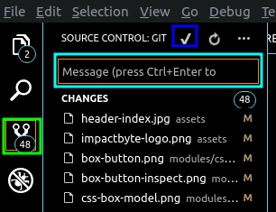
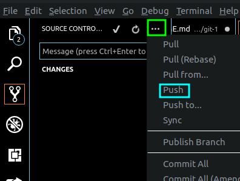

# Git 1

---

## Git

Git is source code management & used mostly by developers to manage their projects and collaborate with others.

### Installation

```sh
# on ubuntu
sudo apt-get install git
```
if have problem / not detect git
```sh
sudo add-apt-repository ppa:git-core/ppa
```

on windows go to [here](https://git-scm.com/download/win)

## first time

we should `config` first with our name and email. This for as information on git about who you are.

```sh
$ git config --global user.name "Your Full Name"
$ git config --global user.email "yourname@example.com"
```

## VS Code Source Control extension
you can do git command by using Source Control.
to do that.
* click `Source Control` icon. it will show you a list files are currently changed.
* give a message on `message box`.
* press checklist. all selected files changed is already commit to push (save to git server).

* click `...` button then click `push` item, to send commit files to git server.
