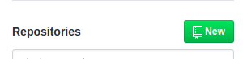
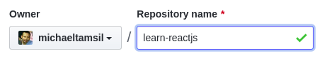
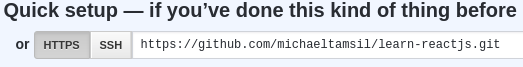
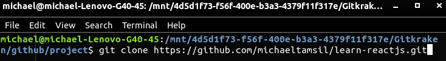
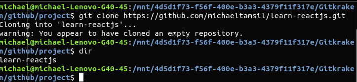

# GitHub 1

---

[GitHub](https://github.com) is platform to publish & collaborate on Git repositories.

The followings are getting started step to use GitHub.

1.  Register for a new user account
2.  Create repository on GitHub


3.  Set repository name with `learn-reactjs` then press button `create repository`


## Syncing Repo with GitHub

When creating repository, you'll see


copy this url.

create folder named `project` then open your terminal / cmd. Directed your path to project folder and type 
```sh
git clone <your_git_url>
```


This will create folder named `learn-reactjs` for us and we will put our code inside that folder.
