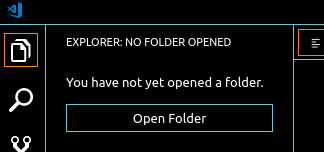
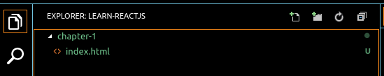
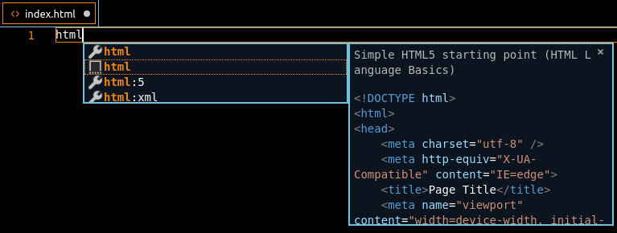
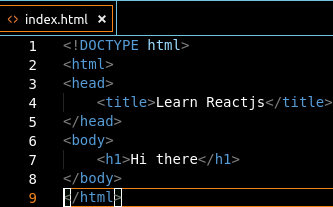

# HTML 1

---

## HTML (HyperText Markup Language)

HTML is the main building blocks of a website. Usually have `.html` file extension. It structures the content what we see.

### Tag

An HTML `tag`/`element` is declared like:

```html
<tag>text</tag>
```

With the opening tag and closing tag, containing the text content.

### Elements

There are various HTML elements based on our intention or usage on the web page:

* For segmenting the web page: `html`, `head`, `body`
* For meta data: `title`
* For text: `h1`-`h6`, `p`, `a`, `span`, `b`, `i`
* For visualizing: `img`, `button`
* For dividing content: `div`, `header`, `footer`, `nav`
* For listing things: `ul`, `ol`, `li`
* For creating a table: `table`, `thead`, `tbody`, `th`, `tr`, `td`
* For form inputs: `form`, `label`, `input`, `fieldset`, `textarea`

---

## create simple website

1. Open your VS Code editor.
2. Click button `open folder`. find foler named `learn-reactjs` & add it.


3. Create new folder inside explorer with right click. named folder with `chapter-1`. create file named `index.html` inside `chapter-1` folder. And the result will be looks like this.


4. Open file of `index.html`. Type inside of it with html and wait, it will show us suggestion.

choose second option, and it will fill our code in `index.html` file

5. update the code and make it like this
   
   


## HTML Attribute

HTML attribute provide additional information about an element and specified in the start tag.

