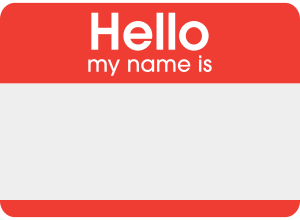
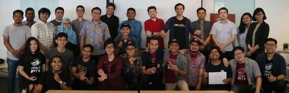

# Introduction

---

## Introduce Ourselves

Let's introduce ourselves to the rest of the class.

1. Who are you? Your name, origin.
2. Why are you deciding to learn to code?
3. What are you working on in your previous current career / job / school?

---

## Impact Byte Ecosystem

In Impact Byte, we're building a special ecosystem for you.

Our team is diversed & working in various areas and industries, from various locations (some are remotes!)

Meanwhile, our Impact Byte Network gather [various partners](https://impactbyte.com/partners)

* [Impact Byte Team](https://impactbyte.com/team)
* [Impact Byte Network + Partners](https://impactbyte.com/partners)

Let's have some photo shoots after this!

---

## Reason learn beginning web development
* job opportunity
* career path
* learn logic through coding
* exciting job