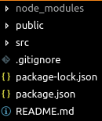

# React 1

## Installation

1. open our `command line interface` or `CLI`
2. type `sudo npm install create-react-app -g`
      * `sudo` in linux is do something, as admin.
      * `-g` it's option that will be add globaly
3. go to inside folder `learn-reactjs` where we already create via git before. [previous lession github-1](./../github-1/README.md)
4. type `create-react-app basic-react`. the `basic-react` means will setup reactjs by creating folder named `basic-react`.
5. open VS Code. do `add folder to workspace`. The folder we add should `basic-react` folder name.

--- 

## On VS Code

1. On explorer menu there folders & files.
    
    

2. Press `CTRL + ~`. Will show terminal menu on below.
3. Type `sudo npm run start` to show our first react app running.
4. Read the message, at least they giving our next step is open our browser with address and port that already designed.

## How it Works

1. `npm run start` what it's mean?. 
   `npm run` command lets we define custom scripts in our `package.json` and `start` is for we run command on `package.json` file on field `scripts` and `on field `start` whichs value is `react-scripts start`.


<!-- ### References

- [`create-react-app`](https://npm.im/create-react-app) installer
- ▢ React Component `class` vs stateless component
  - Building blocks of React, `react`, `react-dom`
  - Import modules or another components
  - JSX `className` vs HTML `class`
  - `state`, `setState`, `getState`
    - initial state vs changed state
  - `props`, `propTypes`, and `defaultProps`
- ▢ React State
  - Passing state to child component
- ▢ React Props
  - Get props from parent component
- ▢ React Render
  - Display `state`/`props`/`variable` inside `render` function
  - Handle `undefined` or unstructured variable with condtional `if`/`||`
  - Conditional rendering
  - Looped rendering using `map`/`filter`
- ▢ React Method
  - `.bind(this)` in constructor
- ▢ React Toolkit
  - Component and virtual DOM
  - Editor Packages: `react`, `jsx`
  - Browser Extensions: React DevTools
- ▢ React Trivia
  - Complete lifecycle of a component
  - Element naming
  - Class-based components
  - Stateless functional components
  - Component-based development
  - Parent and child relationship between components

---

## React JSX

JSX commonly looks like this. It looks like combining HTML inside JavaScript. But in reality, they're just an alternative way to write JavaScript functions.

in JSX:

```js
return (
  <div>
    <h1 className="app-title">App Name</h1>
    <p>{todoList}</p>
  </div>
)
```

---

`create-react-app` project structure:

```sh
.
├── node_modules
├── package.json
├── public
│   ├── favicon.ico
│   ├── index.html
│   └── manifest.json
├── README.md
├── src
│   ├── App.css
│   ├── App.js
│   ├── App.test.js
│   ├── index.css
│   ├── index.js
│   ├── logo.svg
│   └── registerServiceWorker.js
└── yarn.lock
```

Take a look in the `package.json`.

```json
"scripts": {
  "start": "react-scripts start",
  "build": "react-scripts build",
  "test": "react-scripts test --env=jsdom",
  "eject": "react-scripts eject"
}
```

The `react-scripts` in the installer here actually contains:

- webpack module bundler
- Babel JavaScript transpiler

So in the beginning, we don't have to worry to config those, in order to just learn React essentials.

### References

- [`create-react-app`](https://npm.im/create-react-app) installer
- [webpack](https://webpack.js.org)
- [`babel` plugin: `transform-react-jsx`](https://babeljs.io/docs/plugins/transform-react-jsx)

---

## React Components

Building blocks of React:

`react` and `react-dom` are separated modules that we usually use for the web version of React app.

Therefore, if there's other UI library that want to be used with React outside of web browser and DOM, we can use other modules such as `react-native`, `react-native-web`, or `react-vr`.

### References

- [`react`](https://npm.im/react)
- [`react-dom`](https://npm.im/react-dom)
- [`react-native`](https://npm.im/react-native)
- [`react-native-web`](https://npm.im/react-native-web)
- [`react-vr`](https://npm.im/react-vr)

---

## React Lifecycle

React has some important lifecycles that determine the condition when the app is running:

- `componentWillMount`
- `render`
- `componentDidMount`

---

## React Data

Import modules or another components

JSX `className` vs HTML `class`

`state`, `setState`, `getState`

initial state (`this.state`) vs changed state (`this.setState()`)

`props`, `propTypes`, and `defaultProps`

`props` can be accessed in the children component like so:

```jsx
<div index={props.index}>{props.children}</div>
```

## React State

Passing state to child component

---

## React Props

Props as a static data medium that passed in from component to component.

We can get `props` from parent component then use it in child component as `props` or `props.children`

---

## React Render

Display `state`/`props`/`variable` inside `render` function

Handle `undefined` or unstructured variable with condtional `if`/`||`

Conditional rendering

Looped rendering using `map`/`filter`

---

## React Stateless Component

React component can use modern `class` or just a `function` (stateless component).

---

## React Method

Custom method and `.bind(this)` in constructor.

```jsx
class Name extends React.Component {
  constructor(props) {
    super(props)

    this.actionName = this.actionName.bind(this)
  }

  actionName() {
    console.log("Action!")
  }

  render() {
    return <div onClick={this.actionName}>Box</div>
  }
}
```

If we want to use a parameter in the method, don't call it directly.

```jsx
/* do this */
;<div
  onClick={() => {
    this.actionName(param)
  }}
/>

/* not this */
;<div onClick={this.actionName(param)} />
```

--- -->

<!-- ## React Toolkit

Browser Extensions:

- [React Developer Tools](https://github.com/facebook/react-devtools)
  - [React Developer Tools Chrome Extension](https://chrome.google.com/webstore/detail/react-developer-tools/fmkadmapgofadopljbjfkapdkoienihi)
- [React Sight - Live view of the component hierarchy tree of your React application](https://github.com/React-Sight/React-Sight)
  - [React Sight Chrome Extension](https://chrome.google.com/webstore/detail/react-sight/aalppolilappfakpmdfdkpppdnhpgifn)

---

## React Trivia

Component-based design and development.

Each component has a [complete lifecycle](https://reactjs.org/docs/react-component.html) we can use. Complete guide is in [Component Lifecycle Simulators](https://reactarmory.com/guides/lifecycle-simulators)

Element and component naming in React should follow `TitleCase` convention instead of `camelCase` or `lowercase` only. So we should use `ComponentName.js` and `class ComponentName {}`

Class-based components vs Stateless functional components.

Parent and child relationship between components.

Build system with Webpack.

Transpilation with Babel.

--- -->

<!-- ## Glossary

- JSX — Allows us to write HTML like syntax which gets transformed to lightweightJavaScript objects.
- Virtual DOM — A JavaScript representation of the actual DOM.
- `React.Component` — The way in which you create a new component.
- `render` (method) — Describes what the UI will look like for the particular component.
- `ReactDOM.render` — Renders a React component to a DOM node.
- `state` — The internal data store (object) of a component.
- `constructor` (`this.state`) - The way in which you establish the initial state of a component.
- `setState` — A helper method used for updating the state of a component and re-rendering the UI
- `props` — The data which is passed to the child component from the parent component.
- `propTypes` — Allows you to control the presence, or types of certain props passed to the child component.
- `defaultProps` — Allows you to set default props for your component. -->

<!-- ### Component LifeCycle

- `componentWillMount` — Fired before the component mounted/rendered
- `render` - Fired when the actual UI mounted/rendered/changed
- `componentDidMount` — Fired after the component mounted
- `componentWillUnmount` — Fired before the component will unmount
- `getDerivedStateFromProps` - Fired when the component mounts and whenever the props change. Used to update the state of a component when its props change -->

<!-- ### Event Handling with Custom Method

- `onClick`
- `onSubmit`
- `onChange`

When using onEventHandler like those, keep in mind if you want to use the method with a parameter or not. The usage are a bit different.

Wihout parameter, we don't call the function directly:

```js
<button onClick={this.actionName} />
```

With parameter, we call the function directly so we need to wrap it inside a function:

```js
<button
  onClick={() => {
    this.actionName(param)
  }}
/>
``` -->