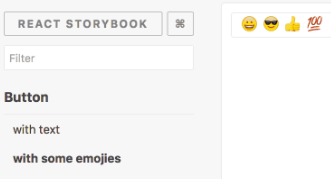

# Story Book 1

---

## Introduction

Interactive UI component dev & test

## Installation

1. Do on our CLI
```sh
npm install @storybook/react --save-dev
```

2. add NPM script on our `package.json`
```sh
{
    "scripts": {
        "storybook": "start-storybook -p 9001 -c .storybook"
    }
}
```

3. Create file at `.storybook/config.js` with the following content
```js
import { configure } from '@storybook/react';

function loadStories() {
    require('../stories/index.js');
    // we can require as many stories as we need.
}

configure(loadStories, module);
```

4. On `../stories/index.js` file. write code like this.
```js
import React from 'react';
import { storiesOf } from '@storybook/react';
import { Button } from '@storybook/react/demo';

storiesOf('Button', module)
    .add('with text', () => (
        <Buton>Hello Button</Button>
    ))
    .add('with some emoji', () => (
        <Button>span role="img" aria-label="so cool">😀 😎 👍 💯</span></Button>
    ))
```

5. Run on your CLI with this command. `npm run storybook`.
   
   