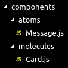
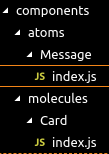
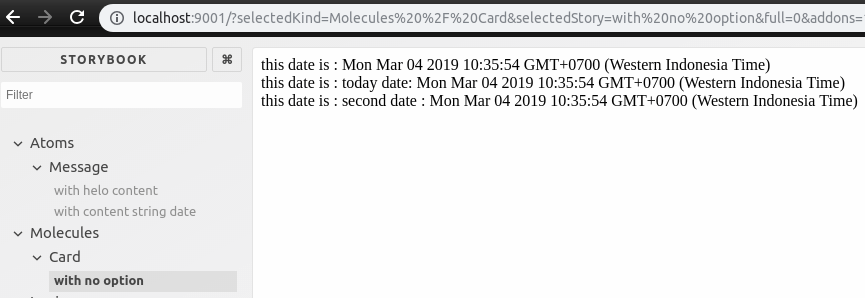

# Story Book 2

---

## Update code [previous](./../react-props-state-1/README.md) lesson

1. change folder & file name from

    

    to be

    

2. on `./molecules/Card/index.js` update a code to be `import Message from './../../atoms/Message';`

---

## Create stories

### On `Message` folder 

create file named `stories.js` with content like below
   ```js
    import React from 'react';
    import { storiesOf } from '@storybook/react';

    import Message from './index';

    storiesOf('Atoms / Message', module)
        .add('with Helo content', () => {
            return (
                <Message>Helo</Message>
            )
        })
        .add('with content string date', () => {
            return (
                <Message>12 Januari 2019 </Message>
            )
        })
   ```

### On `Card` folder

create file named `stories.js` with content like below
   ```js
    import React from 'react';
    import { storiesOf } from '@storybook/react';

    import Card from './index';

    storiesOf('Molecules / Card', module)
        .add('with no option', () => {
            return (
                <Card/>
            )
        }
    )
   ```

---

## On `.storybook/config.js` file

changed to become like this
```js
const req = require.context('./../src', true, /stories.js$/)

function loadStories() {
    req.keys().forEach(filename => {req(filename)})
}
```

## Run Storybook

```sh
sudo npm run storybook
```

after that it will give us information what address & port to open on web browser & see what's storybook like


