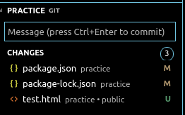

# VSCode Push to Github

---

## How

1. click `source control` icon.
   
   

2. type a message about what we doing in our code.
   
   

3. When our mouse hover on that section, it will show `tick sign` click it. Which means we already commit changes and can be to push to Github.
   
4. on there too have `triple dot` sign. Click it, and will show menus, pick `push`